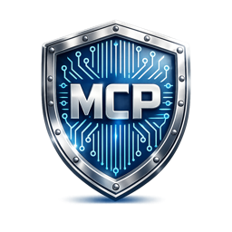
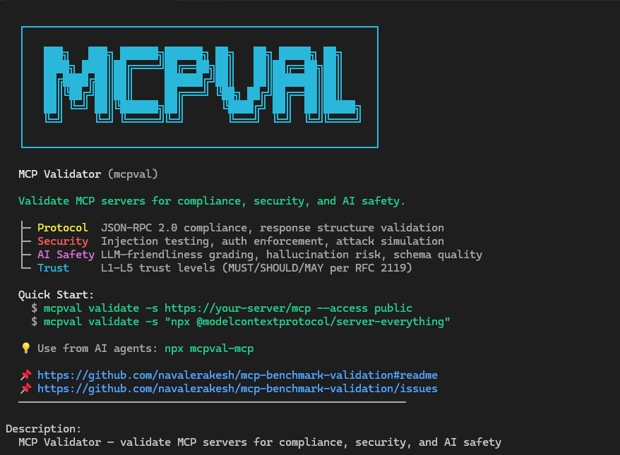

<p align="center">
  
</p>

# MCP Validator (`mcpval`)

[](https://github.com/navalerakesh/mcp-validation-security/actions/workflows/ci.yml)
[](https://dotnet.microsoft.com/)
[](LICENSE)
[](https://www.nuget.org/packages/Mcp.Benchmark.CLI)

> Validate that your MCP server is safe for AI agents. Checks protocol compliance, security posture, AI safety, and assigns a trust level (L1–L5).



## Introduction

- **Purpose**: verify that an MCP server follows the spec, handles errors correctly, resists attacks, and produces responses that AI agents can reason about safely.
- **What it does**: connects via HTTP or STDIO, validates JSON-RPC compliance and response structures, tests authentication enforcement, injects payloads into real tool arguments, grades error clarity for LLM self-correction, and reports a trust level.
- **Who it is for**: anyone building, deploying, or consuming MCP servers — developers, security teams, platform engineers, and AI agent builders.

## Why Run MCP Validator

- **MCP Trust Levels (L1–L5)**: every run produces a multi-dimensional trust assessment measuring Protocol Compliance, Security Posture, AI Safety, and Operational Readiness. Trust level is determined by the weakest dimension (security-first principle).
- **RFC 2119 Compliance Tiers**: checks are classified as MUST (hard compliance gates), SHOULD (weighted penalties), or MAY (informational). A single MUST failure caps the trust level at L2.
- **AI Safety Scoring**: hallucination risk from vague schemas, destructive tool detection, data exfiltration surface analysis, prompt injection resistance, and LLM-friendliness grading of error responses.
- **Real Security Testing**: injection attacks target actual tool arguments via `tools/call` (not the harmless `tools/list` endpoint). 9 auth scenarios per endpoint including revoked tokens and wrong audience (RFC 8707).
- **Deep MCP Response Validation**: validates `tools/call` returns `content[]` with typed items, `resources/read` returns `contents[]` with `uri`+`text/blob`, `prompts/get` returns `messages[]` with `role`+`content` — all per MCP spec requirements.
- **Dual Transport**: HTTP Streamable + STDIO (spawns local MCP servers as child processes). Auto-detects transport from endpoint format.
- **Actionable reporting**: one command produces console summaries plus Markdown, JSON, HTML, and XML outputs ready for tickets or dashboards.

## Architecture Snapshot

The solution follows Clean Architecture: domain abstractions in `Mcp.Benchmark.Core`, transport/rule/scoring engines in `Mcp.Benchmark.Infrastructure`, and the CLI composition root in `Mcp.Benchmark.CLI`. Validators execute in parallel (where safe), all network IO flows through `IMcpHttpClient`, and schema/rule lookups are centralized in `Mcp.Compliance.Spec`. See [docs/Design/Architecture.md](docs/Design/Architecture.md) for diagrams and flow details.

## MCP Trust Levels

Every benchmark run produces a trust level based on 4 dimensions:

| Level | Label | Criteria |
|:------|:------|:---------|
| 🟢 **L5** | Certified Secure | ≥90% on ALL dimensions |
| 🔵 **L4** | Trusted | ≥75% on ALL dimensions |
| 🟡 **L3** | Acceptable | ≥50% on ALL dimensions |
| 🟠 **L2** | Caution | ≥25% or any MUST failure |
| 🔴 **L1** | Untrusted | Critical failures |

**Dimensions measured:**
- **Protocol Compliance** — MCP spec adherence, JSON-RPC 2.0, response structures
- **Security Posture** — Auth compliance, injection resistance, attack surface
- **AI Safety** — Schema quality, destructive tool detection, exfiltration risk, LLM-friendliness
- **Operational Readiness** — Latency, throughput, error rate (informational, does not impact compliance score)

## Quick Start

### Install Locally (dotnet tool)

## Install

```bash
# Install from NuGet (recommended)
dotnet tool install --global Mcp.Benchmark.CLI

# Verify installation
mcpval --help
```

Or download a self-contained exe from [Releases](https://github.com/navalerakesh/mcp-validation-security/releases) — no .NET runtime needed.

### Build from Source

```bash
git clone https://github.com/navalerakesh/mcp-validation-security.git
cd mcp-validation-security
dotnet build
dotnet run --project Mcp.Benchmark.CLI -- validate -s https://your-mcp-server.com/mcp
```

## How to Use the MCP Benchmark CLI

### Validate Command

Runs the full compliance suite (protocol, tools, prompts, resources, performance, security) and saves optional artifacts.

```bash
mcpval validate \
	--server https://api.githubcopilot.com/mcp/ \
	--access authenticated \
	--max-concurrency 2 \
	--output ./TEMP/reports \
	--mcpspec latest \
	--verbose
```

| Option | Description |
| --- | --- |
| `-s, --server <url>` | MCP endpoint or discovery URL. Required unless supplied via config file. |
| `-o, --output <folder>` | Writes Markdown + JSON artifacts for offline reporting. |
| `--mcpspec <profile>` | Overrides the embedded spec profile (e.g., `latest`, `2025-06-18`). |
| `--access <profile>` | Declares server intent (`public`, `authenticated`, `enterprise`) so the validator enforces the right auth gates. |
| `-t, --token <value>` | Injects a bearer token. Pair with `--access authenticated` for enterprise servers. |
| `-i, --interactive` | Launches interactive auth (e.g., browser login) when strategies support it. |
| `--max-concurrency <n>` | Caps concurrent requests to avoid rate limits. |
| `-c, --config <file>` | Supplies a JSON `McpValidatorConfiguration` for advanced scenarios. |
| `-v, --verbose` | Streams detailed progress, transport fallbacks, and scoring notes to the console. |

Every validated run emits: console summary, session logs under `%LOCALAPPDATA%\McpCli\Sessions`, and optional artifacts under the supplied `--output` directory.

### Validate a Local STDIO MCP Server

For local MCP servers that use stdin/stdout transport, pass the command directly:

```bash
mcpval validate \
	--server "npx -y @modelcontextprotocol/server-everything" \
	--access public \
	--output ./reports
```

The CLI auto-detects STDIO transport when the server argument is not an HTTP URL. It spawns the process, communicates via JSON-RPC over stdin/stdout, and runs the full compliance suite.

### Report Command

Transforms saved validation results into polished HTML or XML reports for sharing.

```bash
mcpval report \
	--input ./reports/secure/mcp-validation-20260101-004312-result.json \
	--format html \
	--output ./reports/share/mcp-validation-20260101-004312-report.html
```

| Option | Description |
| --- | --- |
| `-i, --input <file>` | Required. Accepts either the JSON snapshot or the Markdown file created by `validate`. |
| `-f, --format <html|xml>` | Chooses the offline artifact type (HTML default). |
| `-o, --output <file>` | Overrides the destination path; defaults to `<input>-report.<ext>`. |
| `-c, --config <file>` | Optional configuration to tweak branding/report metadata. |
| `-v, --verbose` | Enables verbose logging for troubleshooting offline report rendering. |

### Other Helpful Commands

- `mcpval health-check` — fast connectivity probe with auth hints.
- `mcpval discover` — capability snapshot in JSON/YAML/table form for docs or debugging.

## Documentation

- [docs/README.md](docs/README.md) — documentation index, contributor guide, and workflow links.
- [docs/Design/Architecture.md](docs/Design/Architecture.md) — system overview, layers, and validator pipeline.
- [docs/Design/Schemas.md](docs/Design/Schemas.md) — spec registry, schema layout, and versioning guidelines.
- [docs/Features/00_ToDo.md](docs/Features/00_ToDo.md) — living roadmap tied to feature gaps and impact.

## Contributing

- Fork, branch, and submit PRs following the steps in [docs/README.md#contributing](docs/README.md#contributing).
- Run `dotnet test` before opening a PR and include documentation updates for user-facing changes.

## License

Distributed under the [MIT](LICENSE) License.

