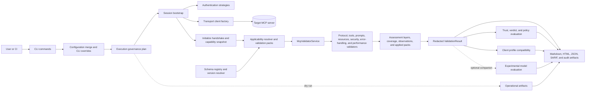
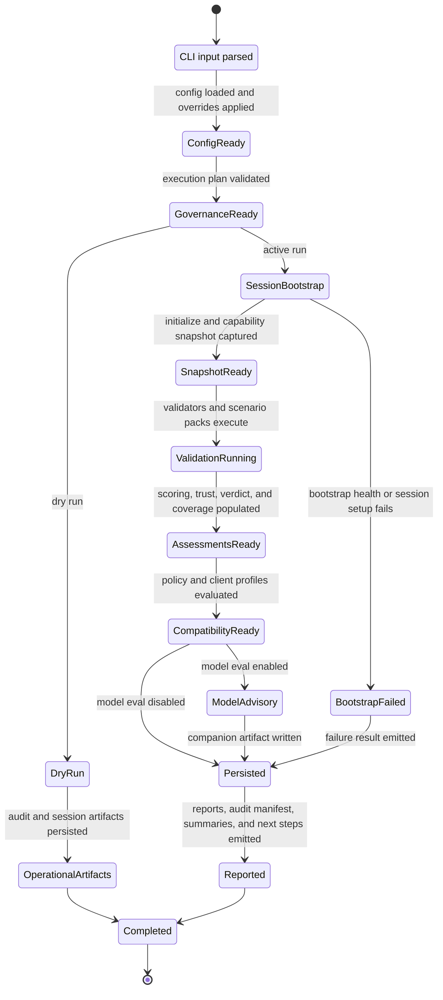

# MCP Validator Architecture

This document describes the stable architectural shape of MCP Validator: project boundaries, runtime flow, run-state transitions, and the artifact contract that other tooling can rely on.

## Architectural Goals

- Keep validation evidence neutral and reusable across hosts.
- Separate host-specific compatibility interpretation from protocol and security evidence.
- Keep execution governance separate from validation evidence and trust assessments.
- Support remote HTTP targets and local STDIO targets without duplicating validator logic.
- Produce deterministic human-readable and machine-readable artifacts that can be archived or re-rendered offline.

## Solution Boundaries

| Project | Owns | Must not own |
| --- | --- | --- |
| `Mcp.Benchmark.Core` | Neutral models, configuration contracts, abstraction interfaces | Host-specific policy, transport code, CLI concerns |
| `Mcp.Benchmark.ClientProfiles` | Client compatibility catalogs and interpretation of neutral evidence | Raw validation execution, transport behavior |
| `Mcp.Benchmark.Infrastructure` | Session bootstrap, transport clients, auth strategies, validators, scoring, reporting | CLI parsing and presentation concerns |
| `Mcp.Benchmark.CLI` | Command binding, dependency injection, console UX, artifact routing, GitHub Actions integration | Validator business logic and host-specific compatibility rules |
| `Mcp.Compliance.Spec` | Vendored schemas, protocol versions, schema descriptors, registry APIs | Validation orchestration or presentation logic |
| `Mcp.Benchmark.Tests` | Architectural, unit, integration, fixture, and snapshot coverage | Shipping runtime behavior |

## Dependency Rules

- `Core` stays host-neutral and framework-light.
- `ClientProfiles` depends on `Core` and interprets completed results without rewriting raw findings.
- `Infrastructure` implements `Core` abstractions and consumes `Mcp.Compliance.Spec`.
- `CLI` is the composition root and may reference the implementation projects it wires together.
- `Tests` may reference all runtime projects but must preserve the intended direction of dependencies.

## Runtime View

## Validation Run State Model

## Validation Pipeline

1. Command input, config-file state, and CLI overrides are merged into a `McpValidatorConfiguration`.
2. Execution governance validates the outbound plan, persistence mode, and dry-run behavior before any network or process activity begins.
3. Session bootstrap resolves transport, checks connectivity, negotiates initialization, and captures the capability snapshot shared by downstream validators.
4. Applicability resolution selects the effective schema version plus the active protocol feature packs, rule packs, and scenario packs for the run.
5. Validators collect neutral evidence across the enabled categories, with performance running after the functional probes so load generation cannot distort protocol or auth findings.
6. The validator service assembles assessment layers, coverage declarations, observations, scoring, trust, and verdict documents from the collected evidence.
7. The CLI applies policy evaluation, client-profile interpretation, and optional model evaluation without mutating the deterministic evidence envelope.
8. The CLI writes explicit output artifacts, emits host summaries, and returns an exit code aligned with the selected policy mode.

## Artifact Model

`validate --output <folder>` writes the standard explicit-output artifact set:

- Markdown report for human review
- HTML report for sharing
- JSON result as the canonical machine-readable record
- SARIF for CI and code-scanning pipelines
- Audit manifest describing the execution plan, saved artifacts, and persistence context

When client profile evaluation produces assessments, `validate` also writes `*-profile-summary.json`. When experimental model evaluation is enabled, `validate` writes `*-model-evaluation.json` as a separate companion artifact.

Session-scoped operational artifacts such as `validate-results`, `report-results`, and `audit-manifest` are persisted through the session artifact store only when the host enables that persistence mode.

The canonical JSON result contains deterministic validation evidence and deterministic derived assessments only. Optional model-evaluation outputs must be written as separate companion artifacts.

`report` consumes saved results and renders additional offline formats such as XML and JUnit. It can start from the canonical JSON result directly or from a Markdown report path that resolves to the sibling `*-result.json`. Reporting never re-runs validation logic; it works from persisted evidence.

## Design Implications

- Client compatibility belongs outside `Core` because it is a host interpretation problem, not a neutral evidence problem.
- Execution governance artifacts such as execution plans and audit manifests belong outside the validation-result evidence envelope even when they are saved alongside explicit output artifacts.
- Transport-specific behavior belongs in shared infrastructure services, not in command handlers.
- Schema lookups flow through the registry so validators stay version-aware without reading files directly.
- Offline reporting depends on persisted results, which keeps sharing and CI pipelines deterministic.

## Related Documents

- [ComponentDesign.md](ComponentDesign.md)
- [TechnicalArchitecture.md](TechnicalArchitecture.md)
- [ForwardArchitecturePlan.md](ForwardArchitecturePlan.md)
- [Schemas.md](Schemas.md)
