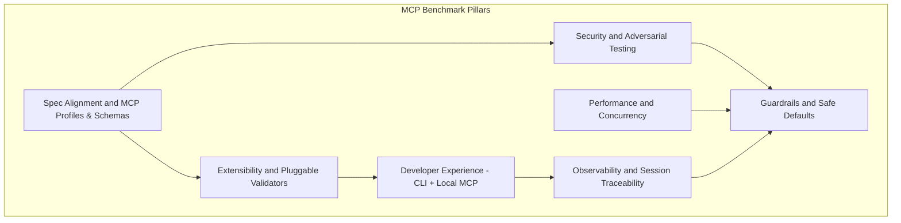
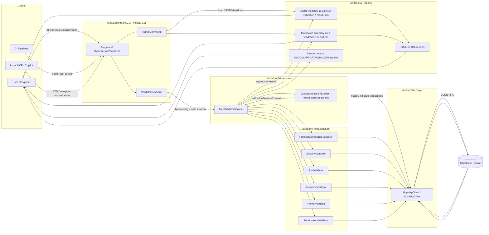
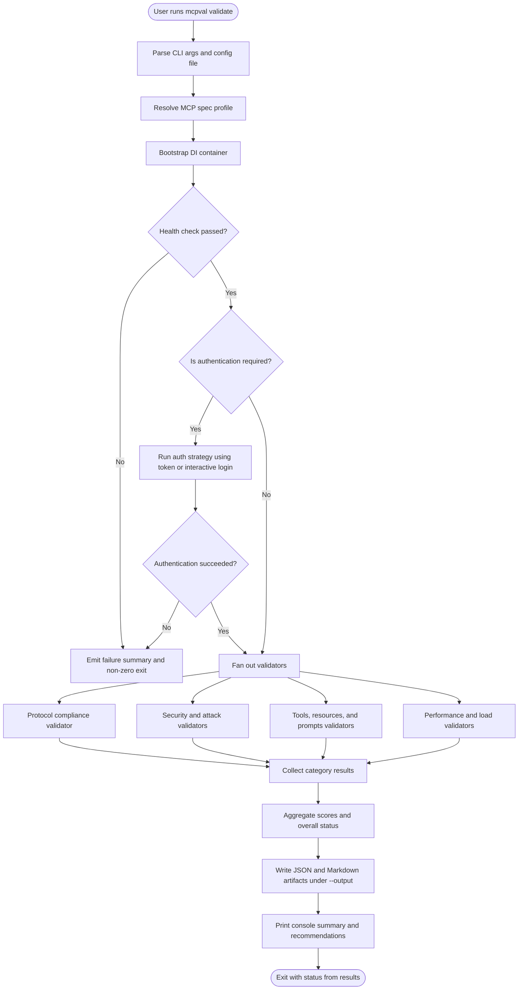
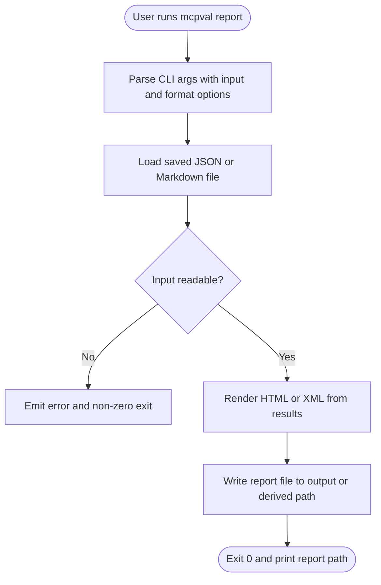
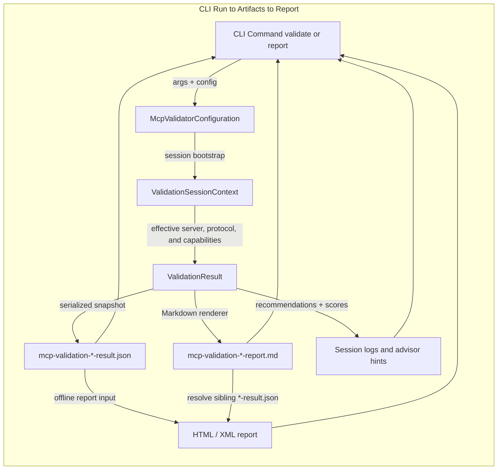

# MCP Benchmark – Architecture & Design

## System Overview

MCP Benchmark is a Clean-Architecture .NET solution that stress-tests Model Context Protocol servers end to end: transport negotiation, JSON-RPC framing, tool/resource/prompt schemas, authentication, security attacks, load testing, scoring, and reporting. The CLI is the composition root and packages the entire validator and benchmarking stack into a single command.

## Design Principles & Practices

This repo is intentionally structured so that the design stays easy to reason about today and flexible for future MCP profiles and servers:

- **Clean Architecture & layering** – domain models and contracts live in a core layer; concrete HTTP clients, validators, and scoring strategies sit in an infrastructure layer; the CLI is a thin composition root. This keeps business rules independent from transport or hosting details.
- **Dependency Injection by default** – all services (validators, clients, scoring, auth) are wired through DI in the CLI entrypoint. Code depends on interfaces, which makes behavior easy to swap in tests and when adding new implementations.
- **Testable units with clear seams** – validators, scoring, and orchestration are designed as small units with explicit dependencies, covered by fast unit tests, integration tests against a mock MCP server, and architecture tests that enforce dependency direction.
- **Configuration-driven behavior** – profiles, concurrency limits, and output options are expressed as configuration rather than baked into code, so new MCP profiles or scoring modes can be introduced without rewriting flows.
- **Extensibility as a first-class concern** – new rules, validators, transports, and auth strategies can be added by plugging into existing interfaces and DI registration, instead of editing core control flow.
- **Safety and observability** – session artifacts (logs, JSON, Markdown, HTML) are produced in a consistent way so that every run is explainable and debuggable, which is essential when validating security and compliance.

## Design Pillars Overview

## End-to-End Component Architecture

## Validate & Report Command Flows

## Session Traceability & Lineage

## Where to Go Next

If you want a deeper, code-level view of layers, services, and extension points, see:

- [Technical Architecture Details](TechnicalArchitecture.md)

If you want to see a concrete example of the report generated by a real `mcpval validate` run and then rendered via `mcpval report`
