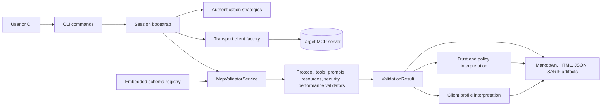

# MCP Validator Architecture

This document describes the stable architectural shape of MCP Validator: project boundaries, runtime flow, and the artifact contract that other tooling can rely on.

## Architectural Goals

- Keep validation evidence neutral and reusable across hosts.
- Separate host-specific compatibility interpretation from protocol and security evidence.
- Support remote HTTP targets and local STDIO targets without duplicating validator logic.
- Produce deterministic human-readable and machine-readable artifacts that can be archived or re-rendered offline.

## Solution Boundaries

| Project | Owns | Must not own |
| --- | --- | --- |
| `Mcp.Benchmark.Core` | Neutral models, configuration contracts, abstraction interfaces | Host-specific policy, transport code, CLI concerns |
| `Mcp.Benchmark.ClientProfiles` | Client compatibility catalogs and interpretation of neutral evidence | Raw validation execution, transport behavior |
| `Mcp.Benchmark.Infrastructure` | Session bootstrap, transport clients, auth strategies, validators, scoring, reporting | CLI parsing and presentation concerns |
| `Mcp.Benchmark.CLI` | Command binding, dependency injection, console UX, artifact routing, GitHub Actions integration | Validator business logic and host-specific compatibility rules |
| `Mcp.Compliance.Spec` | Vendored schemas, protocol versions, schema descriptors, registry APIs | Validation orchestration or presentation logic |
| `Mcp.Benchmark.Tests` | Architectural, unit, integration, fixture, and snapshot coverage | Shipping runtime behavior |

## Dependency Rules

- `Core` stays host-neutral and framework-light.
- `ClientProfiles` depends on `Core` and interprets completed results without rewriting raw findings.
- `Infrastructure` implements `Core` abstractions and consumes `Mcp.Compliance.Spec`.
- `CLI` is the composition root and may reference the implementation projects it wires together.
- `Tests` may reference all runtime projects but must preserve the intended direction of dependencies.

## Runtime View

## Validation Pipeline

1. Command input and configuration are merged into a `McpValidatorConfiguration`.
2. Session bootstrap resolves transport, checks connectivity, and prepares authentication context.
3. Validators collect neutral evidence across the enabled categories.
4. Scoring and policy layers interpret that evidence into overall status, trust assessment, and policy outcome.
5. Client profile evaluation maps the same evidence to documented host expectations without changing the underlying findings.
6. The CLI writes artifacts, prints a concise summary, and returns an exit code aligned with the selected policy mode.

## Artifact Model

`validate --output <folder>` writes the standard artifact set:

- Markdown report for human review
- HTML report for sharing
- JSON result as the canonical machine-readable record
- SARIF for CI and code-scanning pipelines

`report` consumes saved results and renders additional offline formats such as XML and JUnit. Reporting never re-runs validation logic; it works from persisted evidence.

## Design Implications

- Client compatibility belongs outside `Core` because it is a host interpretation problem, not a neutral evidence problem.
- Transport-specific behavior belongs in shared infrastructure services, not in command handlers.
- Schema lookups flow through the registry so validators stay version-aware without reading files directly.
- Offline reporting depends on persisted results, which keeps sharing and CI pipelines deterministic.

## Related Documents

- [ComponentDesign.md](ComponentDesign.md)
- [TechnicalArchitecture.md](TechnicalArchitecture.md)
- [ForwardArchitecturePlan.md](ForwardArchitecturePlan.md)
- [Schemas.md](Schemas.md)