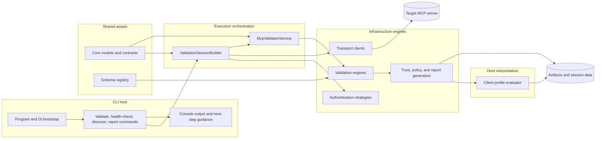

# MCP Validator Component Design

This document focuses on the runtime components, their responsibilities, and how control flows between them during validation and reporting runs.

## Component Map

## Responsibility Matrix

| Component | Owns | Does not own |
| --- | --- | --- |
| `Program` and DI bootstrap | Service registration, command wiring, startup composition | Validation logic, rule decisions |
| Command handlers | Translate CLI input into config, call shared services, choose output paths | Transport implementation, scoring logic, client-profile rules |
| `ValidationSessionBuilder` | Transport detection, bootstrap state, auth preparation, shared session context | Report rendering, CLI formatting |
| `McpValidatorService` | Validator orchestration, result assembly, category coordination | Argument parsing, host-specific presentation |
| Validators | Category-specific evidence collection and rule evaluation | Policy thresholds, client-specific compatibility mapping |
| Trust and policy layers | Convert neutral evidence into trust level and exit behavior | Raw evidence collection |
| Client profile evaluator | Interpret completed evidence against documented host expectations | Network calls or validator execution |
| Report renderers | Produce Markdown, HTML, XML, SARIF, and JUnit from saved results | Live validation or transport activity |

## Interaction Notes

- `validate` and `health-check` share the same bootstrap concepts even though they produce different depths of evidence.
- The canonical record of a run is the saved JSON result. Human-facing reports are renderings of that evidence.
- Client profile interpretation is additive. It explains host compatibility without changing the evidence model that validators produced.
- `report` is intentionally offline. It reads saved artifacts instead of contacting the target again.

## Change Guidance

- Add a new validator when you need new evidence collection or new rule coverage.
- Add a new client profile when a host has documented compatibility expectations that can be derived from existing evidence.
- Add a new report format in the shared reporting layer, then expose it through the CLI host.
- Add a new transport behavior in infrastructure, not by branching command handlers.