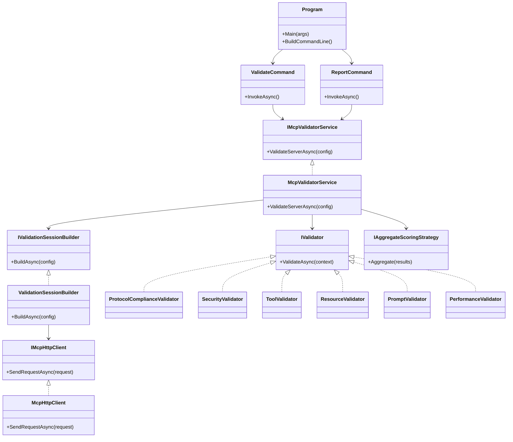

# MCP Benchmark – Component Design

This document shows how the main building blocks of MCP Benchmark fit together: the CLI entry point, orchestration services, HTTP client abstraction, and validators.

The goal is to make it easy to understand "who talks to whom" without diving into every file in the repo.

## High-Level Components

## How to Read This Diagram

- **Program** is the CLI composition root. It wires up dependency injection and registers commands such as `ValidateCommand` and `ReportCommand`.
- **ValidateCommand** and **ReportCommand** are thin shells. They parse arguments and delegate work to **IMcpValidatorService**, keeping business logic out of the CLI layer.
- **McpValidatorService** is the main orchestrator. It builds a validation session, runs validators, and uses **IAggregateScoringStrategy** to turn raw findings into scores.
- **ValidationSessionBuilder** prepares a shared **ValidationSessionContext** (not shown) using **IMcpHttpClient** to talk to the target MCP server and discover capabilities.
- **IMcpHttpClient** and **McpHttpClient** abstract HTTP and JSON-RPC details so validators do not depend on a specific transport implementation.
- **Validators** (protocol, security, tools, resources, prompts, performance) all implement the common **IValidator** interface and operate over the shared session context.
- **IAggregateScoringStrategy** is pluggable, so you can change how scores are aggregated without changing validators.

This structure keeps responsibilities focused and testable: commands are small, orchestration is centralized, transports are abstracted, and validators are pluggable units that can evolve as the MCP spec and best practices change.
