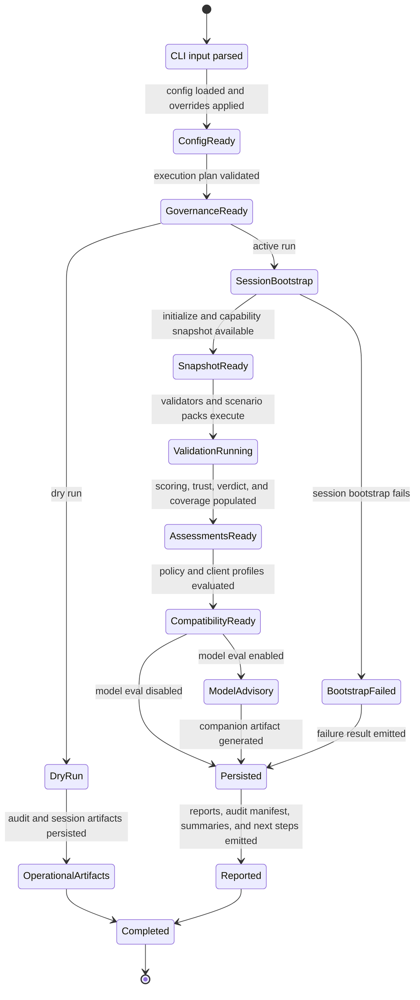

# MCP Validator Technical Architecture

This document is the detailed companion to [Architecture.md](Architecture.md) and [ComponentDesign.md](ComponentDesign.md). It focuses on stable entry points, execution lifecycle, run-state transitions, and extension points for engineers working in the solution.

## Stable Code Map

| Project | Key responsibilities |
| --- | --- |
| `Mcp.Benchmark.CLI` | Command binding, dependency injection, console UX, session-log hints, artifact routing |
| `Mcp.Benchmark.Core` | `McpValidatorConfiguration`, `ValidationResult`, neutral contracts, shared enums and models |
| `Mcp.Benchmark.ClientProfiles` | `ClientProfileCatalog`, host-compatibility descriptors, evidence interpretation logic |
| `Mcp.Benchmark.Infrastructure` | Session bootstrap, transport clients, auth strategies, validators, scoring, report generators |
| `Mcp.Compliance.Spec` | `ProtocolVersions`, schema descriptors, embedded schema registry |

## Execution Lifecycle

1. The CLI binds command-line input and optional configuration into a `McpValidatorConfiguration`.
2. Execution governance validates the run plan, persistence settings, host allowlist, and dry-run behavior before contacting the target.
3. Session bootstrap resolves the target type, performs health and initialization checks, captures the capability snapshot, and establishes authentication context when needed.
4. Applicability resolution determines the effective schema version and the active protocol feature, rule, and scenario packs for the run.
5. Validators execute against a shared session context and collect neutral evidence for each category, with performance testing running after the functional probes.
6. Deterministic scoring, trust, verdict, coverage, and policy services interpret the completed evidence into the final run posture.
7. Optional client profile evaluation interprets the completed result for specific hosts without mutating the raw findings.
8. Optional model evaluation emits separate experimental companion artifacts and never mutates the deterministic result.
9. Report generators render the chosen output formats and the CLI emits the final summary, host annotations, and exit code.

## Run State Model

## Result Document Shape

| Document | Purpose |
| --- | --- |
| `Run` | Validation ID, negotiated protocol version, resolved schema version, applicability context, initialize handshake, capability snapshot, and bootstrap health |
| `Assessments` | Category test results plus layer and scenario rollups |
| `Evidence` | Coverage declarations, observations, and applied validation-pack descriptors |
| `Compatibility` | Client-profile compatibility rollups derived from the completed deterministic result |
| Top-level derived fields | Compliance score, scoring details, trust assessment, policy outcome, summary, and execution logs |

## Command And Transport Behavior

| Command | Behavior |
| --- | --- |
| `validate` | Full execution path for HTTP and STDIO targets |
| `health-check` | Lightweight bootstrap probe for HTTP and STDIO targets |
| `discover` | Remote capability discovery for HTTP targets; STDIO returns a clear not-supported error today |
| `report` | Offline rendering path from a saved JSON result or a Markdown report path that resolves to the sibling JSON result |

Transport detection and auth negotiation are shared infrastructure concerns. Command handlers should not duplicate those decisions.

## Observability And Reproducibility

- The explicit output directory stores the user-facing artifact set intended for people, CI systems, and downstream tooling.
- The saved JSON result is the canonical record for offline rendering and post-run analysis.
- Audit manifests are explicit operational artifacts that describe the execution plan and saved outputs, but they stay outside the deterministic evidence envelope.
- Experimental model-evaluation artifacts are companion outputs and are not part of the canonical deterministic result.
- Session-log hints and optional session JSON artifacts let operators inspect a single run in more detail when persistence mode enables them.
- Inside GitHub Actions, the host also writes step summaries and workflow annotations.

## Extension Points

### Add a new protocol version

- Vendor the schema set under `Mcp.Compliance.Spec/schema/<version>/`
- Register the version in `ProtocolVersions`
- Expose it through the CLI profile catalog
- Add regression coverage proving the registry can resolve the assets

### Add a new validation rule or validator

- Keep the rule and evidence collection in infrastructure
- Reuse the existing neutral result model where possible
- Register deterministic rule metadata through the decision rule-pack registry instead of growing one monolithic descriptor table
- Add unit and integration coverage before exposing it in reports

### Add a new authentication flow

- Implement it as an authentication strategy in infrastructure
- Keep credential acquisition and retry logic out of command handlers
- Surface operator guidance through existing console and next-step services

### Add a new client profile

- Model it in `Mcp.Benchmark.ClientProfiles`
- Derive compatibility from existing evidence instead of introducing client-specific branches into validators
- Document the profile and its assumptions in user-facing docs

### Add a new evaluation lane

- Keep the lane outside deterministic baseline evaluation unless it is fully reproducible
- Persist lane-specific artifacts separately when they are not part of the canonical deterministic record
- Do not let a new lane mutate raw evidence collected by validators

### Add a new report format

- Render from the saved `ValidationResult`
- Expose the format through `report`
- Preserve the JSON result as the source of truth

## Guardrails

- Keep `Core` host-neutral.
- Do not place client-specific compatibility rules inside neutral validators.
- Do not overload rule authority, evaluation lane, and evidence origin into one shared enum.
- Do not place execution governance types such as execution plans or audit manifests inside `ValidationResult` or trust assessment models.
- Do not bypass the schema registry with direct file-system reads in validators.
- Keep reporting deterministic by rendering from saved results instead of re-contacting targets.
